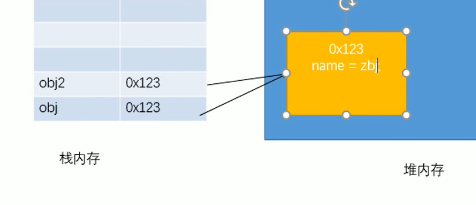
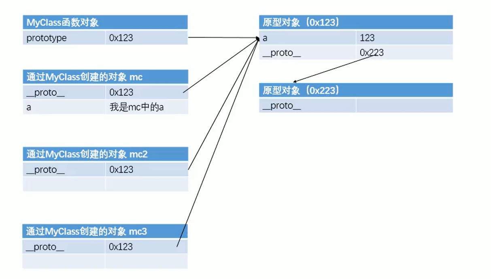

# JavaScriptStudy
### day01
	var a = 123;  
	console.log(a);
	console.log(typeof a);  //输出a的类型 number
	console.log("js可以表示的最大值：" + Number.MAX_VALUE );
	console.log("Number.MAX_VALUE：" + Number.MAX_VALUE*2 ); //输出 Infinity (无穷)
	var b = Infinity;
	console.log("Infinity本身就是表示数字无穷大。var b = Infinity输出：" + b);
	console.log("-Infinity本身就是表示数字负无穷大。-b 输出：" + -b)
### day02
#### 1.1、js一共6中数据类型
	string
	Number    NaN表示非数字(例如"abc"转Number时返回NaN)  Number.MAX_VALUE Number.MIN_VALUE
	boolean   两种数据 false true
	null      检查数据类型返回object
	undefined (声明 未赋值)只有一种数据类型 undefined
	object
#### 1.2、类型转换
#### 1.3、转String
	方法一：toString()方法  a.toString();
		(1)toString()方法返回String类型不改变原来数据的值
		(2)其中null和undefined类型 没有toString()方法
	方法二：String()函数  String(a);
		(1)String()函数返回String类型不改变原来数据的值
		(2)可用于null和undefined类型转换
#### 2、转Number
	方法一：调用Number()函数
		(1)字符串纯数字直接转数字，非数字返回NaN
		(2)字符串空串转为0
		(2)Boolean类型 true转1 false转0 
		(4)null类型转 0
		(5)undefined类型转数字结果为NaN
	方法二：parseInt()函数  从第一个字符开始解析，直到碰到非数字。
		(1)null undefined 都被解析为NaN，其原理为先转String再解析
		(2)parseFloat与parseFloat类似
#### 3、进制表示与转换
		(1)十六进制表示用 0x开头，八进制用0开头，二进制用0b开头
		(2)二进制不同浏览器不同，有的能解析0b开头的二进制，有的报错
		(3)用parseInt()函数解析字符串 a = "070",有的解析为70有的解析为56
				若想解析为十进制，可以用parseInt(a，10) 传递进制来解决
#### 4、转Boolean
	只有一种方法，Boolean()函数
	(1)数字转Boolean只有NaN和0转为false
	(2)字符串转Boolean只有空串转为false
	(3)null和undefined转为false
	(4)object也会转换为true
#### 5、运算符
	(1)typeof 也是一个运算符，返回数据类型，以字符串的形式保存
	(2)算术运算符 +-/*
		非Number数据先转换为Number再进行运算 eg：true + false = 1(true转换为1，false转换为0)
		任何数字跟NaN做运算返回都是NaN
		字符串加法为拼串操作 "123" + 1; null + "123"; undefined + "123";
#### 6、与运算 &&  或运算 ||
	(1)js中与或运算可以进行非Boolean运算，先将非Boolean值转换为Boolean值再进行运算
	(2)&&运算   a && b
		若a为true则直接返回第二个值 eg："hello" && "" 返回hello (Boolean转换中空串转化为false，其他字符串都转化为true)
		若a为false则直接返回第一个值(即a)  eg："" && "hello" 返回hello
#### 7、关系运算符 >= < ==
	(1)可进行数字比较
		非数字比较则转化为数字比较 eg："" < 1 返回true (""转化为0)
		任何数字与NaN比较都返回false eg：123 < "hello" 返回false ("hello"转化为NaN，undefined也转化为NaN)
	(2)若符号两侧都是字符串，则不会转化为字符串再比较，而是比较字符串的Unicode编码
		逐位比较，若相等这比较下一位 eg："11" < "5" 返回true
#### 8、Unicode编码使用输出
	(1)js格式：\u2620  \u后面跟十六进制编码
	(2)HTML格式为&#9760 &#后面跟的是十进制 
#### 9、相等运算
	(1)相等运算 == != 自动类型转换
		一般情况下转换成Number然后进行运算，eg：true == "1" 返回true 
		也有特殊情况 eg：null == 0 返回false
		特殊情况：undefined衍生自null， undefined == null 返回true
		特殊情况：NaN不与任何值相等，也包括它本身。NaN == NaN返回false，判断是否为NaN使用isNaN()函数。
	(2)全等 === 不自动类型转换  !==与===类似
		eg：123 ==="123"返回false
### day03
#### 1、运算符优先级
	(1)&& 比 || 高。 
		eg：1 || 2 && 3; 
		如果 || 优先级高，先计算1 || 2 得true，再计算 true && 3，第一个为true直接输出第二个
		如果 && 优先级高，先计算2 && 3 得true，再计算 1 || true，第一个为true直接输出第一个
#### 2、代码块
	(1)只具有分组作用不能进行隔离。
		eg：{var a = 10;}
			console.log(a); 
			正常输出a的值 10
#### 3、prompt()函数，弹窗，获取输入。
	(1)返回输入内容，类型为字符串。
	(2)+prompt()函数返回Number数据类型
#### 4、带标记的循环  终止整个循环可用 break lable;   终止本次循环可用 continue lable;
	(1)格式
		lable:
		for / switch{
			break lable;
			continue lable;
		}
#### 5、console.time() 计时器
	(1)开始 console.time("计时器名字") 结束并输出 console.timeEnd("计时器名字");
	(2)Math.sqrt(27);  //对num开方
	(3)Math.pow(9,1/2);  //返回x的y次方
#### 6.1、Object 对象数据类型
	(1)内建对象：ES标准中实现的对象，任何使用ES标准的都可以使用
		eg：Math String Boolean Function Object...
	(2)宿主对象：由js的运行环境提供的对象，目前来讲主要指浏览器提供的对象
		eg：BOM DOM (console document)
	(3)自定义对象：由开发人员创立的对象
#### 6.2、自定义对象：由开发人员创立的对象
	(1)构造函数 new Object(); eg: var obj = new Object();
	(2)添加内容 obj.name = "张三"; obj.gender = "男"；
	(3)读取内容 obj.name  读取对象中没有的属性返回undefined
		obj["name"] 中括号内可以放变量 eg: var n = "age"; console.log(obj[n]);
	(4)修改内容 obj.name = "新值"; 
	(5)删除内容 delete obj.name;
	(6)属性名不强制要求标志符的规范 obj.var = "test"; 不会报错
		特殊属性名用 obj["123"] = ""; 语法来存取。(obj.123 = ""  报错！)
	(7)属性值也可为对象 obj.test = obj1; 存取：obj.test.name = ""
	(8)"属性名" in obj 检查obj中是否含有某属性 有则返回true 否则返回 false
		Object对象存放在堆内存中，栈中存放的是堆中的地址引用，如下图。
		因此修改Object对象的属性对其引用的内容也会修改。例子如下：
		var obj1 = new Object();
		var obj2 = new Object();
		obj1.name = "张三";
		obj2.test = obj1;
		
		console.log("obj1.name = " + obj1.name);
		console.log("obj2.test.name = " + obj2.test.name);
		
		//修改obj1的值 则obj2对obj1引用的值也同时会发生变化
		obj1.name = "李四";
		console.log("经过修改： obj1.name = 李四后 ")
		console.log("obj1.name = " + obj1.name);            //返回李四
		console.log("obj2.test.name = " + obj2.test.name);  //返回李四

	
### day04
#### 1.1、基本数据类型存放在栈内存中，对象数据类型存放在堆内存中，栈内存中存放的是对象内容的地址（对象的引用）。
	(1)创建对象会在堆内存中开辟一块空间，存放对象属性
	(2)如果两个变量存放的是一个对象的引用，当一个对象修改对象时，
		另一个也会收到影响，因为他们引用的是同一个内存地址
#### 1.2、Object对象
	(1)创建 var obj = new Object();
			var obj = {name: "张三", age: 20}； 属性名可不加"" 属性名本身就是字符串
			特殊属性值必须就"" eg: "@#$"
	(2)最后一对属性后面不加 ,
	(3)Object对象循环属性，n被逐个按照添加顺序赋值为属性名
		for(var n in obj){
			console.log(n + " = " + obj[n]);
		}
#### 2、function 函数也是个对象 console.log(fun); 可输出函数对象
	fun 表示函数对象， fun() 表示函数调用
	(1)构造函数创建对象 
		var fun = new Function("console.log('你好！')");
	(2)函数声明创建函数对象
		function fun2(){
			console.log("fun2");
		}
		fun2();  //调用
	(3)函数表达式创建函数，将匿名函数赋值给一个变量。与函数声明类似
		var fun3 = function(){
		   console.log("函数表达式创建函数，与函数声明类似");
		};      //这里最好带个; 因为整体是个赋值语句
		fun3();  //调用
	(4)传参数时不会检查参数类型，因此有可能会造成程序出错。所以有必要进行参数类型检验
		function fun4(a, b){
		   console.log(a+b);
		}
		fun4(1,2);
		fun4("hello", 2);  //输出hello2，进行了拼接字符串
	(5)传参数时不会检查参数数量
		fun4(123, 456, 789);   //多余参数不会被使用
		fun4(123); //输出NaN   //缺少参数会被认为时 undefined
	(6)return 返回函数结果，return 之后的语句不会被执行
		函数内不写return返回undefined，return后面不跟内容也会返回 undefined
		返回值的类型与函数内数据类型相同
		unction fun5(a, b , c){
			var res = a + b + c;
			return res;
			alert("return之后代码不会被执行");
		}
		res = fun5(1,2,3);  //程序段不会隔离代码，程序段内用过的变量在程序段外无需声明直接使用
		console.log("res = "+ res);
		console.log(typeof res);  //返回类型为Number
	(7)参数可以是一个函数，也可以在函数内部进行调用
		开发中经常使用的：fun(function(){语句...});
		function fun6(f){  //f传进来一个函数对象
			var result = f(11, 11, 11);   //调用传进来的函数f
			console.log(result);          //输出f返回的结果
		}
		fun6(fun5);  //调用函数fun6 并传入一个函数fun5对象本身
		fun6(fun5());  //调用函数fun6 并传入fun5()的返回值
	(8)立即执行函数
		//立即执行函数,需要加括号保证是一个整体
		(function(){
					   console.log("我是立即执行函数。。。");
		})();  //立即执行函数直接调用，只执行一次
		//立即执行函数也可以传参
		(function(a, b){
			console.log("我是立即执行函数。。。传入参数a,b");
			console.log("a = " + a + "b = " + b);
		})(123, 456);  //立即执行函数直接调用，只执行一次
	(9)对象中的函数叫方法
		//创建含方法的对象
		var obj = {
			name: "张三",
			age: 20,
			sayName: function(){
			   console.log(obj.name);
			},
			sayAge: function(){
				console.log(obj.age);
			}
		}
		//调用obj对象的sayName()方法
		obj.sayName();
		//调用obj对象的sayAge()方法
		obj.sayAge();
#### 3、枚举对象属性 语法：for( 变量 in 对象)
		(1)var obj = {
			name: "张三",
			age: 20,
			address: "文化路"
		}
		for(var n in obj){
			//逐个输出对象属性名和属性值
			console.log(n + " : " + obj[n]);
		}
#### 4.1、作用域(scope)-全局作用域
	(1)在页面打开时创建，在页面关闭时销毁
	(2)全局作用域中的对象都会作为window的对象保存
		var a = 131; //作为window属性保存
		console.log(window.a);  //输出 131
	(3)在使用过程中可以调用 window.属性名 调用，好处是当变量部存在是返回undefined
		直接调用时，变量不存在直接报错 b is not defined
		console.log(window.b);  //输出undefined
		console.log(b);         //报错b is not defined
	(4)函数都会作为window的方法保存
		function fun1(){
		   console.log("fun1方法。。。");
		}
		fun1();         //可用方法名直接调用
		window.fun1();  //函数是window对象的方法
#### 4.2、作用域(scope)-局部作用域（函数作用域）
	(1)在函数内部创建的变量外部不可访问
	(2)每次调用的都是一个作用域，每次作用域不同
	(3)函数内部可访问全局变量，同时存在时优先访问内部的。找不到时访问最近的（函数里套函数情况）
	(4)在函数里(局部作用域)访问全局的用 window.a 来访问
		function fun2(){
			var a = 10;
			console.log("访问局部变量 a：  ：  " + a);
			console.log("访问全局变量window.a：  " + window.a)
		}
		fun2();
	(5)函数内部也会出现声明提前
		function fun3(){
			console.log(a);  //输出undefined，因为var在函数内最先执行
			var a = 11;
		}
		fun3();
	(6)函数内部不使用 var关键字会被认为时全局变量，相当于 window.a
		var c = 100;
		function fun4(){
			console.log("c = " + c);   //输出100，没有用var声明 不会出现声明提前，而是直接向上层访问
			c = 33;           //相当于window.c = 33; 修改了全局变量
		}
		fun4();
		console.log("c = " + c); //输出33在函数内部修改了全局变量
	(7)形参相当于在函数内声明了变量
		var e = 20;
		function fun5(e){
			console.log(e);  //输出undefined，形参相当于var e 即声明了e
		}
		fun5();
#### 5、声明提前
	(1)变量声明提前，即var声明的变量会在所有代码执行前被声明
		console.log(a);  //输出undefined
		var a = 10;
	(2)函数声明创建提前
		fun1();    //fun1会被放到所有代码执行前被创建
		function fun1(){
			console.log("我是fun1。。。");
		}
		
		fun2();  //报错 fun2 is not a function，先声明了 var fun2 函数创建在执行到函数体的时候被创建
		var fun2 = function(){
			console.log("我是函数fun2。。。");
		}
	
### day05
#### 1、this用法  根据函数的调用方式不同this指向不同的对象
	(1)以函数形式调用时，this永远指向window
		var name = "zhubajie"
			function fun(){
				console.log(this.name);
			}
			var obj = {
				name: "sunwukong",
				sayName: fun
			};        
			fun();         //输出zhubajie  以函数形式调用this永远指向window, window.name = zhubajie
	(2)以方法形式调用时，this就是调用函数的那个对象
		obj.sayName(); //输出sunwukong  以方法形式调用this指向obj, obj.name = sunwukong
	(3)一构造方法调用时，this就是新创建的那个对象（详情见构造函数）
#### 2、工厂方法创建对象
	(1)工厂方法创建对象不能区分对象（不能区分是狗对象还是人对象）
		var penson1 = creatPerson("zhangsan", 14, "men");
		var penson2 = creatPerson("lisi", 14, "men");
		var penson3 = creatPerson("wangwu", 14, "men");
		var penson4 = creatPerson("zhaoliu", 14, "men");
		penson1.sayName();
		penson2.sayName();
		penson3.sayName();
		penson4.sayName();
#### 3、构造函数创建对象（创建类）
	(1)可以区分对象类型
		//创建人的构造函数(Dog类，new对象 叫做创建实例)
		function Person(name, age, gender){
			this.name = name;         //this会将值赋给新创建的对象
			this.age = age;
			this.gender = gender;
			this.sayName = function(){
				console.log(this.name);
			}
		}
		var per1 = new Person("zhangsan", 15, "men");
		per1.sayName();     //输出 zhangsan
		console.log(per1);  //输出 Person {name: "zhangsan", age: 15, gender: "men", sayName: ƒ}
		
		//创建狗的构造函数(Dog类，new对象 叫做创建实例)
		function Dog(name){
			this.name = name;         //this会将值赋给新创建的对象
			this.sayHello = function(){
				console.log("我是一只狗汪汪汪···");
			}
		}
		var dog1 = new Dog("wangcai");
		dog1.sayHello();     //输出 我是一只狗汪汪汪···
		console.log(dog1);  //输出 Dog {name: "wangcai", sayHello: ƒ}
	(2)instanceof 判断一个对象的具体类型，是则返回true
		语法 (对象 instanceof 构造函数)
		console.log(per1 instanceof Person);
		console.log(dog1 instanceof Dog);
#### 4、prototype原型对象		
	(1)prototype对象在函数创建时由解析器自动添加
	(2)作为普通函数调用时prototype没有任何作用，
		当作为构造函数调用时，prototype作为隐含属性，可以通过__proto__来访问该属性
	(3)原型对象就像一个公共区域，所有同一个类的实例都可以访问到这个对象
		先在自身对象中寻找，有则直接使用，没有的话向原型对象中寻找
		function Person(name, age, gender){
			this.name = name;         //this会将值赋给新创建的对象
			this.age = age;
			this.gender = gender;
		}
		Person.prototype.sayName = function(){
			console.log(this.name);
		}
		
		var per1 = new Person("zhangsan", 21, "men");
		per1.sayName();  //输出 zhangsan
		
	(4)创建构造函数时，将公有的属性和方法放在prototype中可以被所有实例访问，
		不需要为每一个实例创建对象，也不会污染到全局作用域
	(5)检查类自身是否拥有某属性 hasWonProperty()  自身没有prototype中有也会返回true
		使用 "属性" in obj 来检查时 prototype中含有也会返回true
		console.log(per1.hasOwnProperty("sayName"));  //返回false
		console.log(per1.hasOwnProperty("age"));      //返回true
		console.log("sayName" in per1);               //返回true
	(6)hasOwnProperty在对象的原型的原型中
		console.log(per1.__proto__.__proto__.hasOwnProperty("hasOwnProperty"));//返回true
		原型的原型的原型为null
		console.log(per1.__proto__.__proto__.hasOwnProperty("hasOwnProperty"))
	(7)toString()方法返回的是Object类型，toString()方法在对象的原型的原型里
		console.log(per1.__proto__.__proto__.hasOwnProperty("toString")); //返回true
		可以在原型中修改toString()方法
		Person.prototype.toString = function(){
			console.log("Person[name="+this.name+",age="+this.age+",gender="+this.gender+"]");
		};  //这是一个赋值语句需要加 ;
		per1.toString();
```原型对象```
  
#### 5、垃圾回收机制（GC: Garbage Collect）
	(1)js有自动垃圾回收机制，会自动将垃圾从内存中销毁，我们只需要将不用的对象设置为null即可

#### 6、数组创建和属性(length)
	(1)数组也是一个对象,为object类型
		var arr = new Array();
		arr[0] = "zhangsan";
		arr[20] = 123;  //可不按照顺序添加，中间未设置的元素为undefined
		console.log(arr);
		console.log(arr[10]); //输出undefined
	(2)创建数组的几种方法 js中数组长度没有限制
		//方法一
		var arr = new Array();  
		arr[0] = "zhangsan";
		arr[20] = 123;  //可不按照顺序添加，中间未设置的元素为undefined
		//方法二
		var arr1 = [1, 2, 3, 4];
		console.log(arr1);  //输出[1, 2, 3, 4]多余部分舍弃，相当于重新定义
		arr1 = [1,2,3];
		console.log(arr1); //输出[1, 2, 3]多余部分舍弃，相当于重新定义
		//方法三
		var arr2 = new Array(10);  //表示创建一个长度为10的数组
		arr2[11] = 19;
		console.log(arr2);
		console.log(arr2[11]);  //也可以自动扩展
	(3)arr[2]  获取数组元素
	(4)arr.length  获取元素长度，length为数组的一个属性不是方法无需加()
		length属性也可设置长度 arr.length = 10; 大于赋值元素长度则赋值为undefined 小于则删除超过部分元素
#### 7、数组的几种常用方法
	(1)push() 向数组末尾添加一个或多个元素并返回新的数组长度
		arr.push(1,2,3); //返回最新数组长度。方法参数不能为空，为空则不添加
		arr.push();    //参数为空时不执行添加
	(2)pop() 删除最后一个元素并返回删除元素的值
		var res = arr.pop();  //删除最后一个元素并返回删除元素的值,不需要传参
	(3)unshift() （向右移位） 向数组头部添加一个或多个元素并返回新的数组长度
		len = arr.unshift("头加", "一个或多个");
	(4)shift() （向右移位） 删除第一个元素 并返回第一个元素值
		res = arr.shift();
	(5)toString()  逐个返回元素值用,隔开
		arr.toString(); 
	(6)join()方法 将数组连接成一个字符串，也可传入参数用以间隔，默认用,隔开传
		其中参数必须为字符串否则报错
		console.log(arr.join());      //输出 1,2,3
		console.log(arr.join(""));    //输出 123
		console.log(arr.join("*"));   //输出 1*2*3
		console.log(arr.toString());  //转字符串用 , 隔开
		console.log(*);   //报错 Unexpected token '*'
	(7)delete arr[1];   删除指定位置元素 定义为undefined 与arr[1] = undefined;稍有不同
		console.log(delete arr[1]);   //输出 ["一个或多个", empty, 2]
		arr[1] = undefined;
		console.log(arr);       //输出 ["一个或多个", undefined, 2]
	(8)arr.splice(start, deleteCount, item1, item); 删除元素并向数组中添加新元素 返回删除元素
		第一个参数必填(不填没意义不做删除操作)：表示开始位置，包括start本身
		第二个参数可不填：有参数表示删除个数 为0不删除，无参数表示从start(包括start本身)以后的都删除
		第三四···参数可选填：有参数则从start位置添加，若超过删除元素个数则后面元素自动后移
		arr = [1,2,3,4,5];
		var s = arr.splice(1, 2, 22, 33);
		console.log(arr);  //输出 [1, 22, 33, 2, 3, 4, 5]
		console.log(s);    //输出 [2, 3]
	(9)arr.concat(a) 连接参数a a可以是任意类型，若是数组则直接逐个连接
		返回连接后的数组，原数组不改变
		resConcat = arr.concat(arr);  //可以连接任何元素
		var resConcat = arr.concat("我是连接元素");
		resConcat = arr.concat(arr, arr);  //可传入多个参数连接到一起
	(10)arr.slice(start,end); 按索引截取元素并返回且不改变原数组，包括start 不包括end
		end可以为负值表示倒数第几个（也取不到）
		end值可以省略表示从start（包括start）开始到最后
		resSlice = arr.slice(1);  //到最后
		resSlice = arr.slice(1, -1); //到倒数第一个 且不包括倒数第一个
	(11) arr.sort(); 以Unicode编码顺序排序，改变原数组，返回的改变后的数组
		注意Unicode编码中 16<2
		可自己定义回调函数，达到纯数字排序的目的
		arr.sort(function(a,b){
			// return a-b;  //升序
			return a-b;  //降序
			//返回值大于0 则交换a b位置
			//返回值小于等于0 则不交换a b位置
		});

### day06
#### 1、数组遍历
	(1)for(var i = 0; i<arr.length; i++){
		console.log(arr[i]);
		}
	(2)arr.forEach(function(value, index, obj){}); 方法遍历 （ie8及以下不支持 forEach）
		第一个参数value是正在遍历的元素值
		第二个参数index是正在遍历的元素索引值
		第三个参数obj是正在遍历的数组对象
		arr.forEach(function(value, index, obj){
			console.log("value是正在遍历的元素值: " + value);
			console.log("index是正在遍历的元素索引值: " + index);
			console.log("obj是正在遍历的数组对象: " + obj);
		});
### day07
#### 1、数组遍历
	(1)for(var i = 0; i<arr.length; i++){
		console.log(arr[i]);
		}
	(2)arr.forEach(function(value, index, obj){}); 方法遍历 （ie8及以下不支持 forEach）
		第一个参数value是正在遍历的元素值
		第二个参数index是正在遍历的元素索引值
		第三个参数obj是正在遍历的数组对象
		arr.forEach(function(value, index, obj){
			console.log("value是正在遍历的元素值: " + value);
			console.log("index是正在遍历的元素索引值: " + index);
			console.log("obj是正在遍历的数组对象: " + obj);
		});
#### 2、函数方法
	(1)call() apply() 调函数时可以传一个参数对象，这个对象将会是函数执行时的 this，
		因此达到修改this的目的。如果直接 fun() 调用则this为window
	(2)call()方法可以在obj后依次传入对象
	(3)apply()方法需要以数组形式封装参数
	(4)this的四种情况
		-以函数形式调用this永远都是window
		-以方法形式调用this是调用方法的对象
		-以构造函数形式调用this是新创建的对象
		-以call() apply()调用this是参数指定的那个对象		


### day08
#### 1、正则表达式量词表示
	(1){}表示数目
		var reg = /a{3}/;  //表示有3个连续的a
		console.log(reg.test("aaaadfsdf"));
		reg = /(ab){3}/;  //表示有连续的3个ab
		console.log(reg.test("aasdfabababab"));
		reg = /(b){1, 3}/;  //表示有连续的1到3个ab
		console.log(reg.test("aasdfabababab"));
		reg = /(ab){1,}/;  //表示有连续的1个以上的ab
		console.log(reg.test("aasdbab"));
	(2)+表示至少一个 相当于{1,}
		*表示0个或多个 相当于 {0,}
		? 表示0个或一个
	(3)^a表示以a开头 a$表示以a结尾
		^a$ 表示以a开头和结尾即只有一个a 
	(4) .表示任意字符
		reg = /./;
		var reg1 = new RegExp(".");
		reg = /\./; //表示匹配 .
		var reg2 = new RegExp("\\.");   //表示匹配 . 因为构造函数里面是字符串，一个\表示转义
		console.log(reg2.test(".asfsdf"));
	(5)几种特殊情况
		\w 表示字母、数字、_  相当于[A-z0-9_]
		\W 除了字母、数字、_  相当于[^A-z0-9_]
		\d 表示数字 相当于 [0-9]
		\D 表示除了数字 相当于 [^0-9]
		\s 表示空格  
		\S 表示除了空格  
		\b 表示单词边界 "child" 返回true "children" 返回false
		\B 表示除了单词边界
	(6)匹配开头或者结尾空格
		reg = /^\s* | \s*$/g;

### day09
#### 1、获取对象
	(1)点击事件 写在标签内部 结构和行为耦合不推荐
		单击事件 onclick=
		<button onclick="alert('你点我干啥！')">我是按钮</button>
		双击事件ondblclick=
		<button ondblclick="alert('你双击了我')">双击按钮</button>
		写在js代码中
		var btn1 = document.getElementById("btn1");
		btn1.onclick = function(){
			console.log("你单击了我！");
		};
	(2)js外置或者写在头部 加载后执行
		window.onload=function(){};
	(3)获取同名对象
		获取同名对象
		document.getElementsByName("btnName");
		获取同类名对象
		document.getElementsByClassName("btnClass");
		获取文档中同一标签名对象
		document.getElementsByTagName("button");
	(4)获取属性
		var radioId = document.getElementById("radioId");
		console.log(radioId.value);
		console.log(radioId.name);
		console.log(radioId.id);
#### 2、document查询2
	(1)parentNode函数返回父亲节点
		//获取带标签的内容
		console.log(pn.innerHTML);
		//获取文本，不带标签
		console.log(pn.innerText);
		
	(2)previousElementSibling函数获取前一个兄弟节点
		var ps = hz.previousSibling;          //获取前一个节点，也有可能是空白文本
		var pes = hz.previousElementSibling;  //获取前一个兄弟元素，不包括空白文本
		nextElementSibling 函数获取下一个兄弟节点
		var ns = hz.nextElementSibling;      //获取下一个兄弟元素
	(3)输入框的value就是输入内容
		var sub = document.getElementById("sub");
		var inputId = document.getElementById("inputId");
		sub.onclick = function(){
			console.log(inputId.value);
		};
	(4)firstElementChild函数是获取孩子元素
		ulFirstEleulId = ulId.firstElementChild;
#### 3、document其他查询
	(1)获取body 	var body = document.body;
	(2)获取html var html = document.documentElement;
	(3)获取页面所有元素 document.all 返回一个类数组
	(4)通过class获取一组对象 getElementsByClassName
		注意 ie8及以下不支持 可通过querySelectorAll方法来近似解决
	(5)获取所有div元素 document.getElementsByTagName("div")
	(6)根据css选择器查询元素 document.querySelector(".box div") ie8及以上支持
		只能返回一个元素，若有多个符合条件的则返回第个符合条件的
		可通过 document.querySelectorAll(".box div") 返回多个元素 类数组
		
### day10
#### 00、员工添加删除练习
	(1)多个元素添加事件时用this  使用this 表示当前点击的超链接
	用del[i]返回undefined 因为加载完后执行for循环执行完毕后 当点击超链接时i=3
		for(var i=0; i<del.length; i++){
			del[i].onclick = function(){
				// 使用this 表示当前点击的超链接，用del[i]返回undefined
				var name = this.parentNode.parentNode.firstElementChild.innerHTML;
				var flag = confirm("确认删除"+ name +"吗？"); //点击确认返回true 取消返回false
				if(flag) this.parentNode.parentNode.parentNode.removeChild(this.parentNode.parentNode);
			};
		}
#### 1、添加节点
	(1)添加节点 语法：父节点.appendChild(节点);
		var li = document.createElement("li");      //创建元素节点
		// var text = document.createTextNode("广州"); //创建文本节点
		// li.appendChild(text);   //将文本内容加到元素节点内
		li.innerHTML = "广州";  //innerHTML更方便
		city.appendChild(li);  //添加加点到父节点内，默认在最后面添加
		
		// 方法二 
		// city.innerHTML += "<li>广州</li>"; //会改变父节点内的所有内容
	(2)在某节点前面添加节点 city.insertBefore(li, bj);
		语法：父节点.insertBefore(新节点, 节点);
		var li = document.createElement("li");      //创建元素节点
		var text = document.createTextNode("广州"); //创建文本节点
		li.appendChild(text);   //将文本内容加到元素节点内
		city.insertBefore(li, bj);
	(3)替换节点 语法：父节点.replaceChild(新节点, 旧节点);
		var li = document.createElement("li");
		var text = document.createTextNode("广州");
		li.appendChild(text);
		city.replaceChild(li, bj);
	(4)删除节点 语法：父节点.removeChild(节点);
		city.removeChild(bj);  //删除北京节点
		//bj.parentNode.removeChild(bj); //先获取父节点再删自己
		
### day11
#### 1、DOM修改css样式
	(1)元素.style.属性 = 属性值；
		· 修改后时内联样式
		· 若原样式中有 !important 则定义为最高优先级，内联样式也不可覆盖，不可被修改
		· 如background-color带有-的属性名更改为驼峰命名法
		· 通过style读取/设置的都是内联样式
		· box1.style.width获取的值是带px的字符串，可通过parseInt来解析出来数字部分
		·
	(2)获取元素样式值 getComputedStyle currentStyle获取到的对象都是只读的，修改需要style
		· box1.currentStyle.width  只有ie支持 其他都不支持 不设置时获取auto
		· getComputedStyle(box1,null).width  （ie9+）都支持 不设置时获取真实的值
			第一个参数为元素对象，第二个参数一般用不到
	(3)创建兼容的方法, 若没有设置初始值ie会返回auto
		function getStyle(obj, name){  //第二个参数为字符串
			if(obj.currentStyle){
				return obj.currentStyle[name];
			}else{
				return getComputedStyle(obj, null)[name];
			}
		}
### day12
#### 1、鼠标事件
	(1)onmousemove 鼠标移动事件，当鼠标移动时触发
		传入event 获取鼠标当前坐标 event.clientX  event.clientY
		ie8- event不能被传入，而是在window的属性中，使用window.event.clientX来调用 通过自定义函数判断解决
		目前都支持 event.clientX 火狐已经兼容
		if(event){
			var x = event.clientX;
			var y = event.clientY;
			box2.innerText = "x = "+x+"   y = "+y;
		}else{
			var x = window.event.clientX;
			var y = window.event.clientY;
			box2.innerText = "x = "+x+"   y = "+y;
		}
#### 2、div跟随鼠标移动
	(1)/ clientY 相对于body元素的 如过body宽高过大出现滚动条则鼠标与div有一段距离
		// var left = event.clientX+"px";
		// var top = event.clientY+"px";

		// 可用event.pageX 解决 表示相对屏幕的横坐标，但是ie8—不支持
		var left = event.pageX + "px";
		var top = event.pageY + "px";

		// 获取滚动条滚动位置来解决 ie8- 用document.documentElement.scrollLeft 其他用document.body.scrollLeft
		var scrollLeft = document.body.scrollLeft || document.documentElement.scrollLeft;
		var scrollTop = document.body.scrollTop || document.documentElement.scrollTop;
		console.log("滚动高度：" + document.documentElement.scrollTop);
		var left = event.clientX + scrollLeft;
		var top = window.event.clientY + scrollTop;
#### 3、冒泡取消
	(1)event.cancelBubble = true;
		sp.onclick = function(){
			console.log("点击span");
			event.cancelBubble = true;
		}
#### 4、冒泡事件应用
	(1)绑定事件到父元素，用event.target检测点击元素
		window.onload = function(){
			var ul = document.getElementById("ul");
			ul.onclick = function(){
			console.log(event.target.className=="link");
			alert("你点击了"+event.target.innerText);
			}
		
			var btn = document.getElementById("btn");
			btn.onclick = function(){
				var li = document.createElement("li");
				li.innerHTML = '<li><a class="link" href="javaScript:;">新的超链接</a></li>';
				ul.appendChild(li);
			}
		}
#### 5、事件绑定
	(1)对象.事件 = 函数  只能绑定一个函数，先绑定的会被覆盖掉后面绑定的
		btn.onclick = function(){
			console.log("这是绑定的第一个函数");
		}
		btn.onclick = function(){  //该函数将会覆盖掉第一个函数
			console.log("这是绑定的第二个函数");
		}
	(2)addEventListener(事件, 函数, false) 可同时绑定多个函数 当事件触发时按绑定顺序执行
		第一个参数为字符串 触发监听器的事件，不带on，第二个参数为函数， 第三个参数表示是否在捕获阶段触发，一般为false
		不支持ie8-的浏览器 其他可以
		btn.addEventListener("click", function(){console.log("1")}, false);
	(3)attachEvent(事件, 函数) ie8-支持，ie11和其他浏览器不支持
		btn.attachEvent("onclick", function(){console.log("ceshi");});
	(4)兼容处理 不使用call回调时，this指向不同，ie8-指向btn 其他指向window
		function bind(obj, eventStr, fun){
			if(obj.addEventListener){
				obj,addEventListener(eventStr, function(){
					fun.call(obj);
					// 此时this指的是obj
				}, false);
			}else{
				obj.attachEvent("on"+eventStr, function(){
					fun.call(obj);
					// 此时this指的是obj
				});
			}
		}
	(5)事件绑定解除
		function bind(obj, eventStr, fun){
			if(obj.removeEventListener) obj.removeEventListener{eventStr, fun);
			}else{
				obj.detachEvent("on"+eventStr, fun);
			}
		}
#### 6、事件传播
	(1)事件传播有三个阶段
		1.捕获阶段
			由最外面的祖先元素向目标元素捕获事件，默认此时不会触发事件
		2.目标阶段
			事件到达目标元素
		3.冒泡阶段
			由目标元素向最外面的祖先元素捕获事件
		box1.addEventListener("click", function(){console.log("我是box1")});
		box2.addEventListener("click", function(){console.log("我是box2")});
		box3.addEventListener("click", function(){console.log("我是box3")});
		此时输出 1 2 3
		box1.addEventListener("click", function(){console.log("我是box1")}, true);
		box2.addEventListener("click", function(){console.log("我是box2")}, true);
		box3.addEventListener("click", function(){console.log("我是box3")}, true);
		此时输出 3 2 1
#### 00、拖拽事件
	(1)currentStyle["left"] 表示当前div的距离父元素左侧距离
		offsetLeft.left：如果position是absolute，则是相对于body
		currentStyle["left"] 等同于 offsetLeft.left
	(2) obj.scrollWidth：元素实际宽度，不管是否已经用横向滚动条浏览过
		obj.scrollLeft：元素横向滚动条滚过的宽度。
		未滚过宽度 scrollWidth - scrollLeft - event.clientWidth
### day13
#### 00、滚轮事件
	(1)event.wheelDelta 向上滚为正数，向下滚为负数
		· Firefox不支持 wheelDelta属性 可用 detail 向上滚返回-3 向下滚返回3
		· box1.onmousewheel Firefox不支持，支持DOMMouseScroll, 而且必须用绑定事件
		// Firefox不支持 wheelDelta属性 可用 detail 向上滚返回-3 向下滚返回3
		if(event.wheelDelta > 0 || event.detail > 0){
			box1.style.height = box1.clientHeight + 10 + "px";
		}else{
			box1.style.height = box1.clientHeight - 10 + "px";
		}
#### 1、键盘事件
	(1)键盘事件一般绑定给获取焦点的元素或者document
		· onkeydown 按着部松手会连续触发
		· onkeyup   松下触发
		· altkey shiftkey  alt是否被按下 被按下返回true event.shiftKey
			if(event.shiftKey && event.keyCode == 65) console.log("shift和a同时按下");
		· keycode 通过keycode打印按键编码，同时判断被按下的按键 unicode编码
	(2)输入内容时 input的默认行为返回false后将不会执行输入
		inputId.onkeydown = function(){
			console.log("按下");
			return false;  // 输入内容时 input的默认行为返回false后将不会执行输入
		}
		应用：不能输入数字
		inputId.onkeydown = function(){
			console.log("按下");
			if(event.keyCode>=48 && event.keyCode<=57) return false;
		}
#### 2、获取当前left top值 box1.style.offsetLeft box1.style.offsetTop box1.style.left box1.style.top
	(1)box1.style.left 当box1.style.left未设置时返回auto，设置时返回 100px
		box1.style.offsetLeft 当box1.style.left未设置时返回0，设置时返回 100
#### 3、BOM 浏览器对象模型 操作浏览器
	(1)BOM对象
		· window 对象 浏览器窗口，是网页的全局对象
		· Navigator 代表浏览器信息 识别不同浏览器
		· Location 代表地址栏信息 获取地址栏信息，操作跳转地址
		· History 浏览器的历史记录通过该对象获取浏览器历史记录，
			由于隐私原因不能获取具体的历史记录只能操作浏览器向前向后，而且该操作只在当次访问时操作
		· Screen 代表用户屏幕信息 获取用户显示器信息
	(2)Navigator Location History Screen 都是window的对象 使用时可以window.navigator 也可以直接navigator
	(3)使用userAgent 判断浏览器类型 判断ie11时用 "ActiveXObject" in window
		// 判断浏览器, 使用正则表达式
		if(/chrome/i.test(navigator.userAgent)){
			console.log("你是chrome浏览器");
		}else if(/firefox/i.test(navigator.userAgent)){
			console.log("你是firefox浏览器");
		}else if(/msie/i.test(navigator.userAgent)){
			console.log("你是ie浏览器");
		}else if("ActiveXObject" in window){
			console.log("你是ie11浏览器");
		}
	(4)History使用
		console.log(history.length);  // history.length 返回访问网页长度
		// history.back();     // 跳转到下一个页面 与浏览器前进按钮一样
		// history.forward();  // 跳转到下一个页面 与浏览器前进按钮一样
		// history.go();          // 传入一个整数参数n 表示向前（正数）/向后（负数） 跳转n个页面
	(5)location
		· alert(location);  // 返回获取到地址栏信息
		· 修改location后直接跳转到链接，或者修改相对路径 同时会生成历史记录
			location = "https://www.baidu.com/";  // 绝对路径
			location = "../index.html"  // 相对路径
		· hash 设置或返回#开始的url
		· location = "https://www.baidu.com/";  // 绝对路径
			location = "../index.html"  // 相对路径
			location.hash 获取#开始的url
			location.href 返回地址栏完整地址
			location.hostname 返回主机名
			location.port  返回端口号
			location.protocol  返回协议
			location.search  返回?后的开始的url（查询部分）
			alert(location);  // 返回获取到地址栏信息
			修改location后直接跳转到链接
			或者修改相对路径 同时会生成历史记录
			location = "https://www.baidu.com/";  // 绝对路径
			location = "../index.html"  // 相对路径
			console.log(location.hash);  //获取#开始的url
			console.log(location.href);  //返回地址栏完整地址
			console.log(location.hostname); // 返回主机名
			console.log(location.port);    //返回端口号
			console.log(location.protocol);  //返回协议
			console.log(location.search);  //返回?后的开始的url（查询部分）
			
			location.assign("https://www.baidu.com");  //功能与直接修改location一样
			location.reload();  //刷新页面 与点击刷新按钮一样， 可传入参数true 表示清空缓存
			location.reload(true);
			location.replace("../index.html");  //替换当前文档，与assign类似，
												//但是不保留历史记录，无法返回
#### 4、定时器
	(1)setInterval(myFun, 1000); 第一个参数传入函数第二个参数传入间隔秒数
		· 表示间隔1000毫秒myFun执行一次。
		· 返回一个Number类型值 表示定时器编号
		· 可用clearInterval(timer);关闭定时器，
			传入setInterval的返回值表示定时器编号，可传入任意值，若为无效的则什么都不做
			
		function myFun(){
			h1.innerHTML = num++;
			if(num == 5){
				clearInterval(timer); //关闭定时器 ，var timer会提前声明
			}
		}
		var timer = setInterval(myFun, 1000);
#### 4、轮播图
	start.onclick = function() {
		// 添加定时器之前先关闭，避免添加多个定时器
		clearInterval(timer);
		timer = setInterval(function() {
			console.log("定时器已启动");
			var img = ["img/1.jpg", "img/2.jpg", "img/3.jpg", "img/4.jpg"];
			index = index % img.length;
			imgId.src = img[index++];
		}, 1000);
	}
	stop.onclick = function() {
		clearInterval(timer);
	}

### day14
#### 3、类操作
	(1)通过修改类名修改简介修改属性
		浏览器只需要渲染一次页面，使表现和行为进一步分离
		div1.className += " box2";
	(2)判断是否已经含有cn类
		有则返回 true 无则返回 false
		function hasClass(obj, cn){
			// \b 正则表达式 表示单词边界
			var reg = new RegExp("\\b"+cn+"\\b");
			return reg.test(obj.className);
		}
	(3)给元素添加类addClass
		添加不重复类 重复则不添加
		function addClass(obj, cn){
			if(!hasClass(obj, cn)){  // 如果没有cn类则添加
				obj.className += " "+cn;
			}
		}
	(4)删除类 delClass
		添加不重复类 重复则不添加
		function delClass(obj, cn){
			var reg = new RegExp("\\b"+cn+"\\b");
			// 将cn 替换为空串即可删除
			obj.className = obj.className.replace(reg, "");
		}
	(5)切换类 toggleClass
		有则删除无责添加
		function toggleClass(obj, cn){
			var reg = new RegExp("\\b"+cn+"\\b");
			if(hasClass(obj, cn)){ // 有则删除
				delClass(obj, cn);
			}else{                 //无则添加
				addClass(obj, cn);
			}
		}
#### 5、eval()函数
	(1)传入js语句 以字符串形式，利用eval()函数可执行js语句
		eval("alert('hello');");
	(2)ie7-不支持JSON类 可用eval()函数执行
		var v = eval("("+obj+")");  // 加括号避免将JSON串中的{}当做代码块边界，可用变量接收执行结果
		兼容ie7-也可以引入json库
#### 6、JSON
	(1)JSON是一种特别的对象可以被任何语言识别
		JSON对象和js对象一样，但JSON对象属性名必须加引号
	(2)JSON分类
		对象 {} var obj = '{"name": "张三", "age":18, "gender": "man"}';
		数组 [] var arr = '[1,2,3,"hello",true]';
		
	(3)JSON允许的值
		字符串
		数字
		布尔值
		null
		对象（普通对象） var arr2 = '[{"name": "张三", "gender": "man"}, {"name": "张三", "gender": "man"}]'
		数组
	(4)js中提供一个工具类 JSON 可讲JSON转化为js对象，js对象转化为JSON对象
		· JSON对象转js对象 JSON.parse(obj)
			var jsO = JSON.parse(obj);  // JSON对象转js对象
			var jsA = JSON.parse(arr);  // JSON对象转js数组
		· js对象转JSON对象 
			var jso3 = JSON.stringify(obj3);
	(5)ie7-不支持JSON可通过引入外部文件来解决
		<script src="../js/JSON-js/json2.js" type="text/javascript" charset="utf-8"></script>
### day15
### 特技

/*
#### 1、
	(1)
	(2)
	(3)
	(4)
	(5)
*/
	

1.  使用 Readme\_XXX.md 来支持不同的语言，例如 Readme\_en.md, Readme\_zh.md
2.  Gitee 官方博客 [blog.gitee.com](https://blog.gitee.com)
3.  你可以 [https://gitee.com/explore](https://gitee.com/explore) 这个地址来了解 Gitee 上的优秀开源项目
4.  [GVP](https://gitee.com/gvp) 全称是 Gitee 最有价值开源项目，是综合评定出的优秀开源项目
5.  Gitee 官方提供的使用手册 [https://gitee.com/help](https://gitee.com/help)
6.  Gitee 封面人物是一档用来展示 Gitee 会员风采的栏目 [https://gitee.com/gitee-stars/](https://gitee.com/gitee-stars/)
